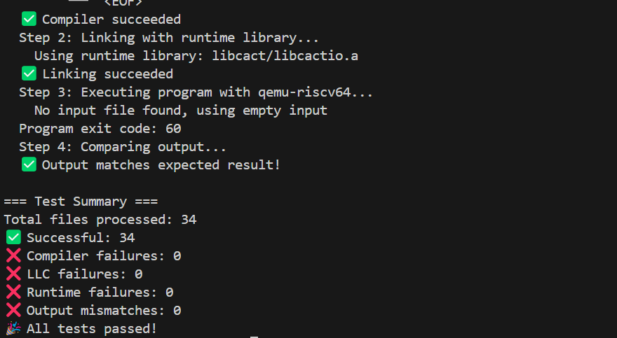

# 实验报告: RISC-V 64位代码生成器

## 任务说明
- 基于给定的LLVM IR中间表示，设计并实现一个编译器后端。

- 该后端的目标是生成能在RISC-V 64位架构上运行的汇编代码。

- 实现关键的后端技术，包括栈帧管理、指令选择、寄存器分配以及函数调用约定。

- 最终能够将完整的LLVM IR模块（包括全局变量和函数）转换为功能等价的RISC-V汇编文件。

## 成员组成
艾华春, 李霄宇, 王淼

## 实验设计
### 设计思路
本次实验旨在构建一个将LLVM IR转换为RISC-V 64位汇编代码的编译器后端。设计遵循模块化和分阶段处理的原则，将复杂的代码生成过程分解为几个核心组件和步骤：

1. 栈帧管理 (RiscvFrame): 设计一个独立的类来负责函数栈帧的布局和管理。在进入每个函数编译前，首先对该函数的所有指令进行一次预分析（analyzeFunction），计算出所有局部变量、临时值和参数所需的总栈空间。这包括为保存的返回地址（ra）和父函数帧指针（s0）预留空间。通过这种方式，可以在函数序言中一次性分配整个栈帧，并通过固定的栈指针（sp）偏移量来访问所有栈上数据。

2. 核心代码生成器 (RiscvGenerator): 这是后端的主驱动类。它负责遍历LLVM IR模块中的每一个顶层实体（全局变量和函数）。
    - 分段生成: 将汇编代码明确地分为 .data 段（用于全局变量）和 .text 段（用于函数代码），以符合标准汇编格式。

    - 指令映射: 为每一种需要处理的LLVM IR指令实现一个对应的生成函数（如 generateLoad, generateArithmetic 等）。这种方法使得代码结构清晰，易于扩展和维护。

    - 函数调用: 严格遵循RISC-V调用约定，处理参数传递（通过a0-a7和fa0-fa7寄存器）和返回值（通过a0/fa0）。

2. 寄存器分配: 采用一种简化的动态寄存器分配策略。

    - 临时寄存器池: 维护一个固定的临时寄存器池（整数t0-t6，浮点ft0-ft6）。

    - 按需分配与溢出: 当需要寄存器时，从池中循环获取（getTempReg, getFloatTempReg）。如果选中的寄存器当前正被一个变量占用，则先生成将该变量“溢出”（Spill）到其对应栈槽的指令，然后再重新分配该寄存器。

    - 状态跟踪: 使用一个_regMap来实时跟踪LLVM虚拟寄存器（如 %1, %2）到物理寄存器（如 t0, t1）的映射关系。

3. 全局数据处理: 实现对全局变量和常量的处理，能根据其类型和初始值生成正确的 .word, .float, .double, .byte, 或 .zero 伪指令。对于复杂的初始化列表（如数组），使用正则表达式进行解析。

### 编译器后端目录结构
```C++
backend/
├── RiscvGenerator.h
├── RiscvFrame.h
├── RiscvGenerator.cpp
└── RiscvFrame.cpp
```
## 实验实现 (核心模块解析)
### RiscvFrame：栈帧管理器
RiscvFrame是内存管理的核心。它的主要职责是在代码生成前确定一个函数所需的完整栈空间大小。

1. 栈帧布局分析 (analyzeFunction)

    这是RiscvFrame最关键的方法。它在编译一个函数之前被调用，遍历函数内的所有指令来决定需要为哪些变量在栈上分配空间。

```C++
void RiscvFrame::analyzeFunction(const LLVMFunction &func) {
    // 为ra和fp保留固定的16字节
    RA_OFFSET = 0;
    FP_OFFSET = 8;
    _totalSize = 16; 
    
    // 为函数参数分配空间
    for (const auto &param : func.parameters) {
        // ...
        addLocal(param.name, size);
    }

    // 遍历所有指令，为需要存储在栈上的结果分配空间
    for (const auto &block : func.basicblocks) {
        for (const auto &inst : block->llvm_ins) {
            if (inst.type == LLVM_INS_T::ALLOCA) { // alloca指令直接分配
                // ...
                addLocal(name, size);
            } else if (inst.type == LLVM_INS_T::ADD || /* ...其他计算指令... */) {
                // 为计算结果的虚拟寄存器预留栈空间，用于后续可能的溢出
                std::string name = ssa2riscv(inst.result);
                addLocal(name, size);
            }
            // ... 对其他指令（GEP, bitcast等）做类似处理
        }
    }
}
```
固定偏移: ra (返回地址) 和 s0 (旧的帧指针) 总是在栈帧的固定位置，便于在函数序言和尾声中统一处理。

预分配: 通过这种预分析，我们不仅为alloca指令分配了空间，还为每一个计算结果（虚拟寄存器）都预留了“后备”栈槽。这使得我们的寄存器分配器在需要溢出寄存器时，总能找到一个确定的内存位置。

### RiscvGenerator：代码生成器
这是实现从IR到汇编转换的主力。

1. 整体流程 (generate)
```C++
void RiscvGenerator::generate(std::ostream &out) {
    // 1. 生成 .data 段 (全局变量)
    _dataSection << ".data\n";
    for (const auto &entry : _module.entries) {
        if (std::holds_alternative<LLVMGlobalVar>(entry)) {
            generateGlobalVar(std::get<LLVMGlobalVar>(entry));
        }
    }

    // 2. 生成 .text 段 (函数代码)
    _textSection << ".text\n";
    for (const auto &entry : _module.entries) {
        if (std::holds_alternative<LLVMFunction>(entry)) {
            // ...
            generateFunction(std::get<LLVMFunction>(entry));
        }
    }

    // 3. 组合并输出
    out << _dataSection.str() << "\n" << _textSection.str();
}
```
该方法驱动整个生成过程，确保了输出汇编文件的标准结构。

2. 函数序言与尾声 (generateFunction)

    每个函数都围绕一个标准的序言（Prologue）和尾声（Epilogue）结构来生成。

```C++
void RiscvGenerator::generateFunction(const LLVMFunction &func) {
    // ... 初始化当前函数环境 ...
    _currentFrame.analyzeFunction(func);
    int frameSize = _currentFrame.getTotalFrameSize();

    // --- 函数序言 (Prologue) ---
    _textSection << "  addi sp, sp, -" << frameSize << "\n"; // 1. 分配栈帧
    _textSection << "  sd ra, " << _currentFrame.RA_OFFSET << "(sp)\n"; // 2. 保存返回地址
    _textSection << "  sd s0, " << _currentFrame.FP_OFFSET << "(sp)\n"; // 3. 保存旧帧指针
    _textSection << "  addi s0, sp, " << frameSize << "\n"; // 4. 设置新帧指针

    // ... 函数体指令生成 ...

    // --- 函数尾声 (Epilogue) ---
    _textSection << ".L" << func.name << "_exit:\n"; // 统一退出点
    _textSection << "  ld ra, " << _currentFrame.RA_OFFSET << "(sp)\n"; // 1. 恢复返回地址
    _textSection << "  ld s0, " << _currentFrame.FP_OFFSET << "(sp)\n"; // 2. 恢复旧帧指针
    _textSection << "  addi sp, sp, " << frameSize << "\n"; // 3. 释放栈帧
    _textSection << "  ret\n"; // 4. 返回
}
```
这个标准结构确保了函数的正确调用和返回，以及栈的平衡。所有ret指令最终都跳转到统一的_exit标签，简化了流程。

3. 指令选择与生成 (以generateArithmetic为例)

    LLVM IR中的每条指令都被翻译成一段等效的RISC-V指令序列。

```C++
void RiscvGenerator::generateArithmetic(const LLVM_INS &inst) {
    // 示例: %c = add i32 %a, %b
    std::string dest = ssa2riscv(inst.result);
    std::string op1_name = ssa2riscv(inst.operands[0]);
    std::string op2_name = ssa2riscv(inst.operands[1]);

    // 步骤1: 将操作数加载到临时寄存器
    // - 如果操作数已在寄存器中，直接使用
    // - 如果是立即数，用 `li` 加载
    // - 否则，从其栈槽中用 `lw` 加载
    std::string tempReg1 = /* ... logic to load op1 ... */;
    std::string tempReg2 = /* ... logic to load op2 ... */;

    // 步骤2: 执行计算
    std::string resultReg = getTempReg(); // 为结果分配一个新寄存器
    _textSection << "  add " << resultReg << ", " << tempReg1 << ", " << tempReg2 << "\n";
    
    // 步骤3: 记录结果位置
    // 更新映射表，现在 dest (%c) 的值位于 resultReg 中
    _regMap[dest] = resultReg;
}
```
这个模式（加载操作数 -> 执行操作 -> 记录结果位置）在大多数指令生成函数中被复用，包括 generateLoad, generateStore, generateIcmp 等。

对浮点运算 (generateFArithetic) 也采用了同样模式，只是使用了浮点寄存器（ft0-ft6）和浮点指令（fadd.s, flw, fsw等）。

4. 寄存器分配与溢出 (getTempReg)

    这是实现动态寄存器管理的核心。

```C++
std::string RiscvGenerator::getTempReg() {
    tempRegIndex = tempRegIndex % 7; // 使用 7 个临时寄存器 t0-t6
    for (const auto &pair : _regMap) {
        if (pair.second == "t" + std::to_string(tempRegIndex)) {
            std::string VarName = pair.first; // 找到对应的变量名
            if (_currentFrame.hasLocal(VarName)) {
                int offset = _currentFrame.getOffset(VarName);
                int size = _currentFrame.getSize(VarName);
                _textSection << "  # Storing t" << tempRegIndex << " to stack for variable " << VarName << "\n";
                if (size == 4) {
                    _textSection << "  sw t" << tempRegIndex << ", " << offset << "(sp)\n"; // 将寄存器值存储到栈上
                } else if (size == 8) {
                    _textSection << "  sd t" << tempRegIndex << ", " << offset << "(sp)\n"; // 将寄存器值存储到栈上
                } else {
                    throw std::runtime_error("Unsupported variable size for storing in stack");
                }
                _regMap.erase(VarName); // 从寄存器映射中移除
            }
            break;
        }
    }
    return "t" + std::to_string(tempRegIndex++); // 返回 t0, t1, t2, ...
}
```
    
这种“溢出旧值，腾出新用”的策略虽然简单，但在临时寄存器数量有限的情况下，有效地保证了代码生成的正确性。

## 测试程序情况
使用脚本 `./run2.sh` , 依次编译测试文件夹中的33个cact测试程序, 并链接运行时库, 生成可执行文件, 最后与测试文件夹中的真实输出对比. 

结果: 通过了全部的33个测试程序




## 总结
本项目成功实现了一个功能较为完备的编译器后端，能够将LLVM IR转换为RISC-V 64位汇编代码。

- 完整的代码结构: 能够生成包含 .data 和 .text 段的标准汇编文件。

- 数据与函数支持: 成功处理了全局变量（包括数组及其初始化）、函数定义和函数调用。

- 栈帧管理: 实现了稳健的栈帧布局策略，通过预分析和固定偏移量确保了函数调用的安全和高效。

- 核心指令集: 支持了LLVM IR中大部分核心指令的转换，包括：

    - 内存操作: load, store, alloca, getelementptr

    - 算术运算: add, sub, mul, div (整数和浮点)

    - 控制流: br (条件/无条件分支), ret

    - 比较与逻辑: icmp, fcmp, and, or

    - 类型转换: bitcast

- 寄存器分配: 实现了一种简单而有效的按需分配和溢出机制，使得后端能够在有限的临时寄存器下正确工作。

该后端为将高级语言编译到RISC-V平台提供了坚实的基础，其模块化的设计也为未来进一步的优化（如更高级的寄存器分配算法、指令调度等）留出了空间。